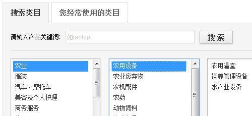
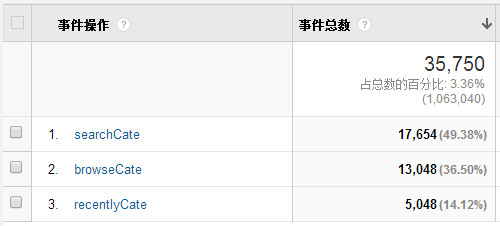

讨论一例交互--常用类目
===

在我们的网站后台有个很重要的功能，就是让用户发布产品，发布产品之前需要给该产品选择一个类目。类目的选择有以下三种方式。  
####1.直接浏览类目树  
操作方法：选择次级类目……依次类推下去，最多有四级类目。  

####2.通过关键字搜索  
操作方法：在“请输入产品关键字”之后的输入框中输入关键字后，点击搜索按钮就可以看到相应类目。 

####3.常用类目选择
为了用户操作遍历，我们提供了更好用的功能，常用类目列表。我们网站的客户是外贸企业，他们的产品类型一般比较单调，比如一般不会有一个企业既卖大型机械，又卖MP3，所以一个客户的类目也就那么几种，并且越是常用的类目越是靠前，很容易在常用列表中找到。  
操作方法：点击“您经常使用的类目”Tab，然后选择一个常用类目。  

以上三种方法都介绍完了，请你猜一猜有多少用户选择了方法1（浏览），多少用户选择了方法2（搜索），又有多少用户选择了方法3（常用类目）。如果你是用户，你会使用那种方法呢？  
  
针对该问题我进行了Google Analytics打点，得到如下表格。  

从表格中可以看出。50%的用户发现搜索起来更快更容易找到自己想要的类目，有14%的用户不负我们网站的苦衷，使用常用类目快速找到其想要的类目，但是仍然有36%的用户选择直接浏览器类目，不厌其烦地一级一级选择类目。这个数据让我大失所望，我一直认为应该由更多的用户选择常用类目。  

失望归失望，我们还是要分析问题，解决问题。  

####1.常用类目过于隐蔽
由于页面上要显示的内容很多，而页面就那么大一块地方，所以我们就需要让内容折叠起来，这时候Tab作为一种很好的展现方式，被大多数网站所使用，但是不得不说，用户为了看到Tab中隐藏的内容，需要用户将鼠标移动到相应Tab头上，甚至需要多一次点击，比起默认显示的内容，**多了一个操作步骤**，这些都是用户需要付出的操作成本。另外一个问题，就是当初我们实现扁平化设计以及简约的网站风格，将**Tab头的背景色调的很淡**。如果用户不仔细看都看不到还不到“您经常使用的类目”这几个字，即使看到了，还不一定知道这是Tab头，还可以点击，其背后还有一个桃花源。  

关于操作步骤，在《点石成金 访客之上的网页设计秘笈》（也就《别让我思考》）一书中，作者也强调这个问题，比如作者就十分痛恨为了节省空间，使用Select下拉框的行为。他认为下拉框具有以下缺陷，①用户必须点击下拉框才能看到其所有选项，多了一个操作②当选项过多时，很难看清楚，很容易选错。即使设计师意识到这一点，想为其设置更加友好优美的样式，也很难，因为在很多浏览器其样式不可更改或者不能完全更改，等等。

####2.首次使用网站时，常用类目列表为空
当用户第一次进入该网站时，假如说他注意到了还有常用类目这一项，他可能会点进去看个究竟，但是进去之后却发现空空如也，没有我想要的东西，用户失望地回到Tab的第一页，他也不知道该用什么关键字来搜索他想要的类目，只能一级一级地找寻，一级一级的选择，就这样该用户一直延续这个习惯。  

我们的网站在设计的时候还是犯了一个错误，在用户刚进来，还没有发布任何产品，系统也不为其生成常用类目的时候，仍然在页面上显示了这样一个Tab，万一用户点进去什么也看不到，会非常失望。  

####3.常用类目使用Iframe加载
**使用iframe加载较慢**，部分用户可能因为无法忍受又多一次加载过程，而放弃。

以上只是结合GA打点结果，针对常用类目做的一些YY猜想，不一定准确的，但是在找到更好的办法之前，需要针对以上几点做一个改变，希望更多的用户使用搜索类目或者常用类目。做到真正的方便用户，用户第一。  